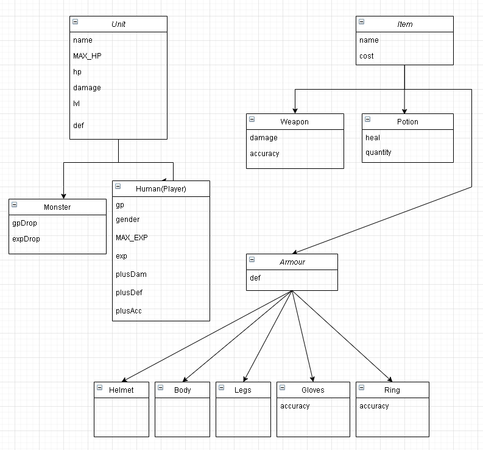

# RPG_GUI

# Entity structure table

# Comparing changes from previous version
- Added unit base stats (level, defense)
- Added monster experience drops
- Added player's base stats (exp, plus damage, plus defense, plus accuracy)
- Added weapon accuracy stats
- Added potion quantity for inventory stacks
- Added armour class having base defense stats, extended armour class (shop available) :
  - Helmet
  - Body
  - Legs
  - Gloves
    - accuracy
  - Ring
    - accuracy
- Added console clear
- Extended equipment slots
- Extended wielding/tossing options
  - Added variance to stats due to wielding and unwielding items
  - Added current wielding view
- Added basic view template for shop and inventory
  - Space in between stats automation added
- Town player's view changed with new stats
